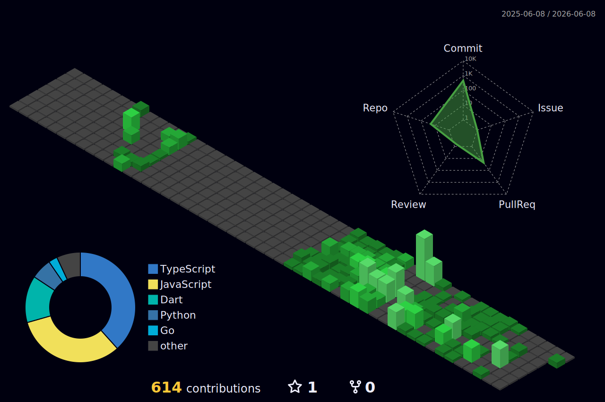

# Hi, I'm Niraj 👋

Software engineer interested in high-performance systems, modern C++, database internals, and AI infrastructure.

Currently focused on understanding how large-scale systems are built—from storage engines and vector search to low-latency backend architectures.

  

  

## Connect

  
  

  

---

## Current Focus

### 3D Contribution Calendar

---

## What I'm Building

Currently working on AI-powered security and risk assessment systems while exploring storage engine internals, retrieval architectures, and high-performance backend systems.

Most of my recent learning revolves around modern C++, database internals, vector databases, networking, and scalable system design.

---

## Primary Stack

### Languages

### Systems

### Databases & Search

### Backend

---

## Familiar With

---

## GitHub Stats

  
  

  

